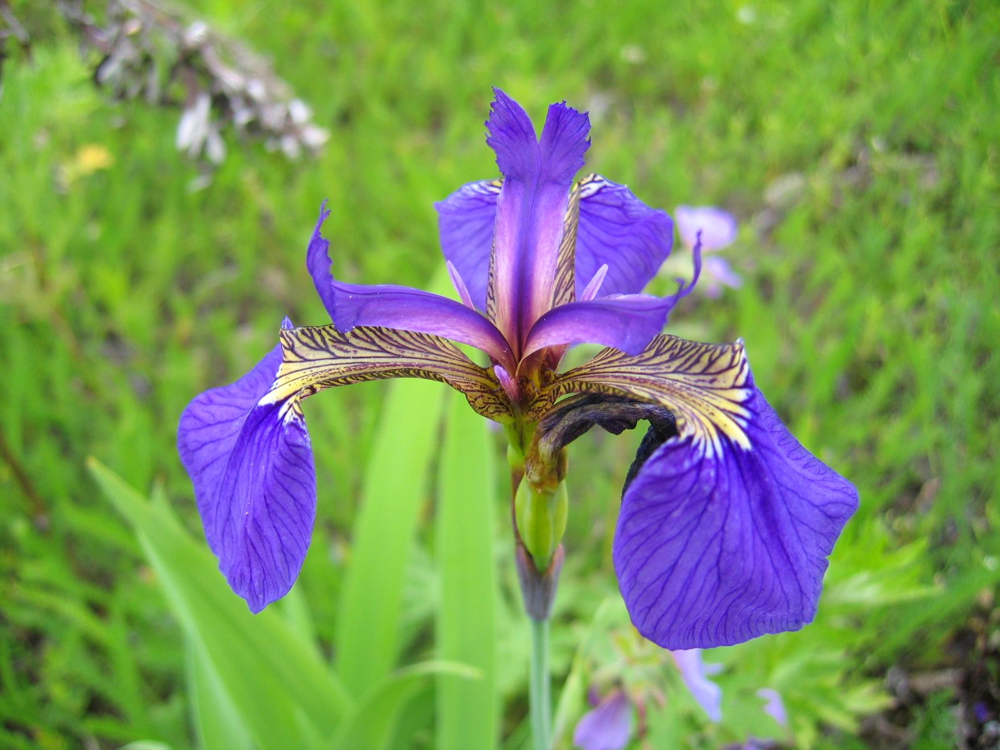
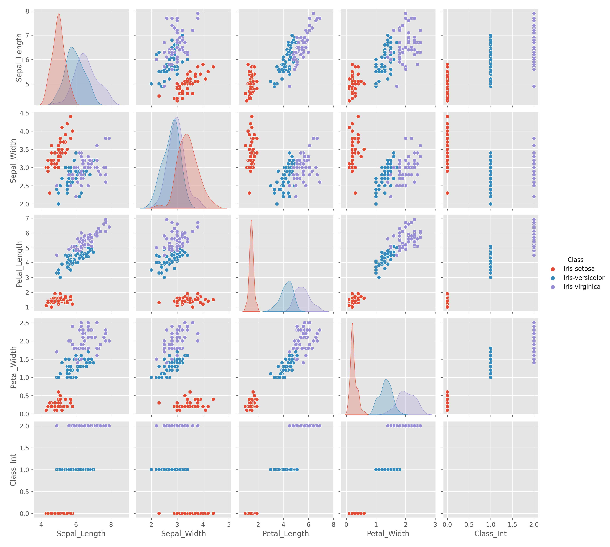

---
---

# Narrative

## Introduction

The [Iris Dataset](https://archive.ics.uci.edu/ml/datasets/iris), accessible through the UCI Machine Learning Repository, is part of a vast array of databases utilised by the machine learning community to conduct evaluations of machine learning algorithms. The Iris dataset is frequently employed in pattern recognition learning. This multivariate dataset's default machine learning task is classification. It contains 150 instances with five attributes, four of which represent sepal and petal measurements for each data point, while the fifth attribute indicates the class or species of Iris plant to which each data point belongs. The dataset encompasses 50 plants from each of the three Iris plant classes, with each class representing a distinct species: Iris Setosa, Iris Versicolor, and Iris Virginica. It was originally created by R.A. Fisher in 1936 and was donated by Michael Marshall in 1988.

    
    
    

## Process

In this code the Iris dataset was analysed. This dataset contains measurements of sepal and petal lengths and widths for three different species of iris flowers. The script is organised as follows:

1. Imported necessary libraries: The required libraries were imported: pandas, numpy, matplotlib, itertools, seaborn, and sklearn. These were added to throughout the process when required.[1,](#ref1)[3](#ref3)
2. Set plot style: The ggplot style is applied to the plots for better visualization.[5](#ref5)
3. Loaded dataset: The Iris dataset is loaded into a DataFrame with custom column headers using pandas.[1,](#ref1)[2](#ref2)
4. Generated summary statistics: We calculate summary statistics for each column and save the resulting DataFrame to a text file.[1,](#ref1)[3](#ref3)
5. Created histograms: For each numeric variable, a histogram is generated, displaying the distribution of values. This was created by looping through the column headers. Each histogram is saved as a PNG file.[3,](#ref3)[8](#ref8)
6. Create scatterplots: Scatterplots are created for all combinations of numeric variables, with different colors representing the different iris species due to the Seaborn 'hue' parameter. Using the itertools.combination method a loop through the tuples generated produced a scatterplot for every possible combination. Each scatterplot is saved as a PNG file.[3,](#ref3)[4,](#ref4)[5](#ref5)
7. Created pairplot: A pairplot is generated using seaborn, which provides a compact visualization of all possible scatterplots between numeric variables, as well as histograms for each variable. The pairplot is saved as a PNG file.[3,](#ref3)[4,](#ref4)[5](#ref5)
8. Created correlation heatmap: A correlation heatmap is created to visualise the correlation between the numeric variables. The heatmap is saved as a PNG file. [5](#ref5)
9. Added a machine learning logistic regression model to the dataset. Used sklearn to split the data into a training set and a test set. Created the model with the inbuilt functions and then evaluated it on the test set data. [9,](#ref9)[10](#ref10)
10. Completed a README.md of the process.[6,](#ref6)[7](#ref7)

# Analysis
## Main Statistics
From the analysis of the dataset we can see that the following are some of the main statistics of the dataset:

</head>
<body>
<table>
  <tr>
    <th rowspan="2">Class</th>
    <th colspan="3">Sepal_Length</th>
    <th colspan="3">Sepal_Width</th>
    <th colspan="3">Petal_Length</th>
    <th colspan="3">Petal_Width</th>
    <th colspan="3">Class_Int</th>
  </tr>
  <tr>
    <th>mean</th>
    <th>max</th>
    <th>min</th>
    <th>mean</th>
    <th>max</th>
    <th>min</th>
    <th>mean</th>
    <th>max</th>
    <th>min</th>
    <th>mean</th>
    <th>max</th>
    <th>min</th>
    <th>mean</th>
    <th>max</th>
    <th>min</th>
  </tr>
  <tr>
    <td>Iris-setosa</td>
    <td>5.006</td>
    <td>5.8</td>
    <td>4.3</td>
    <td>3.418</td>
    <td>4.4</td>
    <td>2.3</td>
    <td>1.464</td>
    <td>1.9</td>
    <td>1.0</td>
    <td>0.244</td>
    <td>0.6</td>
    <td>0.1</td>
    <td>0.0</td>
    <td>0</td>
    <td>0</td>
  </tr>
  <tr>
    <td>Iris-versicolor</td>
    <td>5.936</td>
    <td>7.0</td>
    <td>4.9</td>
    <td>2.770</td>
    <td>3.4</td>
    <td>2.0</td>
    <td>4.260</td>
    <td>5.1</td>
    <td>3.0</td>
    <td>1.326</td>
    <td>1.8</td>
    <td>1.0</td>
    <td>1.0</td>
    <td>1</td>
    <td>1</td>
  </tr>
  <tr>
    <td>Iris-virginica</td>
    <td>6.588</td>
    <td>7.9</td>
    <td>4.9</td>
    <td>2.974</td>
    <td>3.8</td>
    <td>2.2</td>
    <td>5.552</td>
    <td>6.9</td>
    <td>4.5</td>
    <td>2.026</td>
    <td>2.5</td>
    <td>1.4</td>
    <td>2.0</td>
    <td>2</td>
    <td>2</td>
  </tr>
</table>

</body>
</html>

    

## Comments
Some takeaways from the dataset are:  
 - Iris-virginica showes a greater sepal length, whereas Iris-setosa has a wider sepal width. In the case of Iris-setosa, the sepal width exceeds the sepal length.  
 - The highest frequency for petal length is situated between 1 cm and 2 cm, with a count of 50. This can be seen in the histogram.  
 - The petal length and petal width are highly correlated to each other throughout each iris class with a score of 0.96. This can be seen in the heatmap and pairplot.  
 - The model has printed a high accuracy of approximately 0.97, which means it made correct predictions 97% of the time.  

---

# References
<a name="ref1">1.</a>&nbsp; [A Gentle Introduction to Pandas Data Analysis](https://www.youtube.com/watch?v=_Eb0utIRdkw)  

<a name="ref2">2.</a>&nbsp; [How To Add Header Row To A Pandas DataFrame](https://stackoverflow.com/questions/34091877/how-to-add-header-row-to-a-pandas-dataframe)  

<a name="ref3">3.</a>&nbsp; [W3Schools Pandas Tutorial](https://www.w3schools.com/python/pandas/pandas_analyzing.asp)  

<a name="ref4">4.</a>&nbsp; [How Do I Iterate Through Combinations Of A List](https://stackoverflow.com/questions/41680388/how-do-i-iterate-through-combinations-of-a-list)  

<a name="ref5">5.</a>&nbsp; [Exploratory Data Analysis with Pandas Python 2023](https://www.youtube.com/watch?v=xi0vhXFPegw&t=2s)  

<a name="ref6">6.</a>&nbsp; [Footnotes in Markdown](https://www.javatpoint.com/footnotes-in-markdown)  

<a name="ref7">7.</a>&nbsp; [How to add footnotes to GitHub-flavoured Markdown?](https://stackoverflow.com/questions/25579868/how-to-add-footnotes-to-github-flavoured-markdown)  

<a name="ref8">8.</a>&nbsp; [iterating quickly through list of tuples](https://stackoverflow.com/questions/16021571/iterating-quickly-through-list-of-tuples)  

<a name="ref9">9.</a>&nbsp; [Intro to Machine Learning with Python 3: Train Test Split and Baseline Modeling](https://www.youtube.com/watch?v=MufPx3L7nXM&list=PLMAyPTgGwv2DUV6DZib9eMetsTTX87JNr&index=3)  

<a name="ref10">10.</a>&nbsp; [Scikit Learn : Confusion Matrix, Accuracy, Precision and Recall](https://www.youtube.com/watch?v=TtIjAiSojFE)  

<a name="ref10">11.</a>&nbsp; [Creating a Markdown Table](https://tablesgenerator.com/markdown_tables) 

<a name="ref10">12.</a>&nbsp; [Add Images in Markdown and Modify Image Size](https://linuxhint.com/add-images-markdown-modify-image-size/) 

